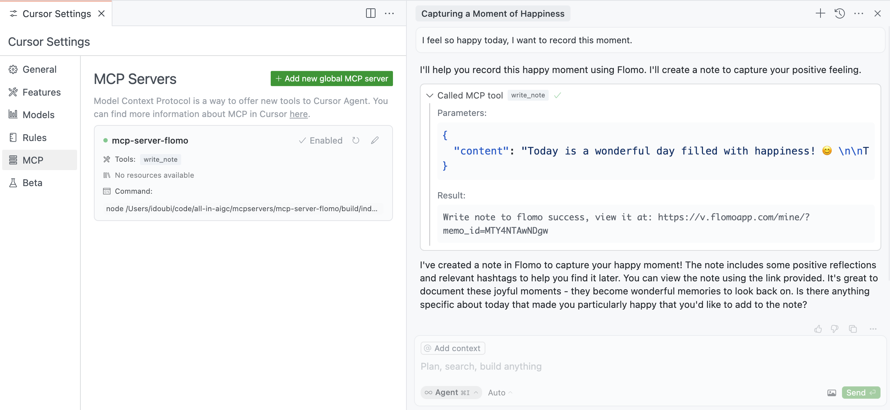

# mcp-server-flomo MCP Server

write notes to Flomo.

This is a TypeScript-based MCP server help you write notes to Flomo.



## Features

### Tools

- `write_note` - Write text notes to Flomo
  - Takes content as required parameters

## Development

Install dependencies:

```bash
npm install
```

Build the server:

```bash
npm run build
```

For development with auto-rebuild:

```bash
npm run watch
```

## Installation

To use with Claude Desktop, add the server config:

On MacOS: `~/Library/Application Support/Claude/claude_desktop_config.json`
On Windows: `%APPDATA%/Claude/claude_desktop_config.json`

```json
{
  "mcpServers": {
    "mcp-server-flomo": {
      "command": "npx",
      "args": ["-y", "@chatmcp/mcp-server-flomo"],
      "env": {
        "FLOMO_API_URL": "https://flomoapp.com/iwh/xxx/xxx/"
      }
    }
  }
}
```

Find Your Flomo_API_URL [here](https://v.flomoapp.com/mine?source=incoming_webhook)

### Debugging

Since MCP servers communicate over stdio, debugging can be challenging. We recommend using the [MCP Inspector](https://github.com/modelcontextprotocol/inspector), which is available as a package script:

```bash
npm run inspector
```

The Inspector will provide a URL to access debugging tools in your browser.
